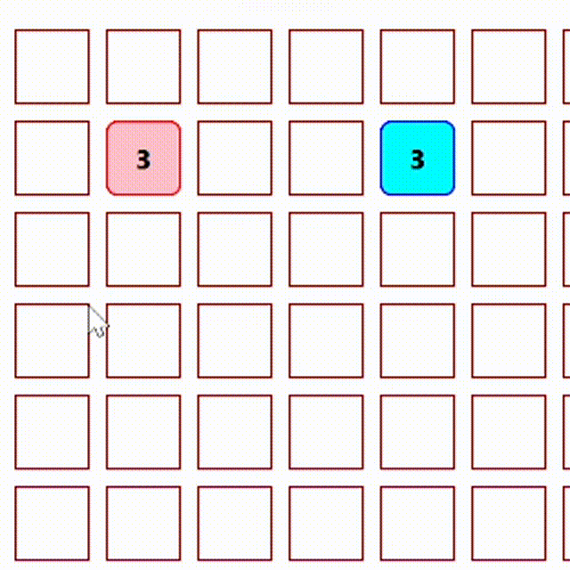

# Conquer the Land Game
<b>The main moto to make this game is to polish my problem-solving skills because that's the secret key to achieve success in ethical hacking</b>

I am also working on making CPU mode. At the first, I will make using random selection and after I learned AI then I will surely upgrade it.

I will also improve the readablity of the code after implementing all the features.

<b>This will be updated time to time!</b>

As i said, i just focused on logics so if anyone is interested to improve the UI then his/her contribution will be highly appreciated.
## Usage
Just Visit the webpage : https://hackwarebro.github.io/Conquer-The-Land-Game/

This game only supports 2 player mode!

## Gameplay
Simply, you have to win by occuring the more places than your opponent within a prescribed limit of moves which you selects in the start of the game.

you can check the gameplay in the how to play game section on my webpage.

## Contributing

1. Fork it!
2. Create your feature branch: `git checkout -b my-new-feature`
3. Commit your changes: `git commit -am 'Add some feature'`
4. Push to the branch: `git push origin my-new-feature`
5. Submit a pull request :D

<h3><b>Connect with me:</b></h3>

